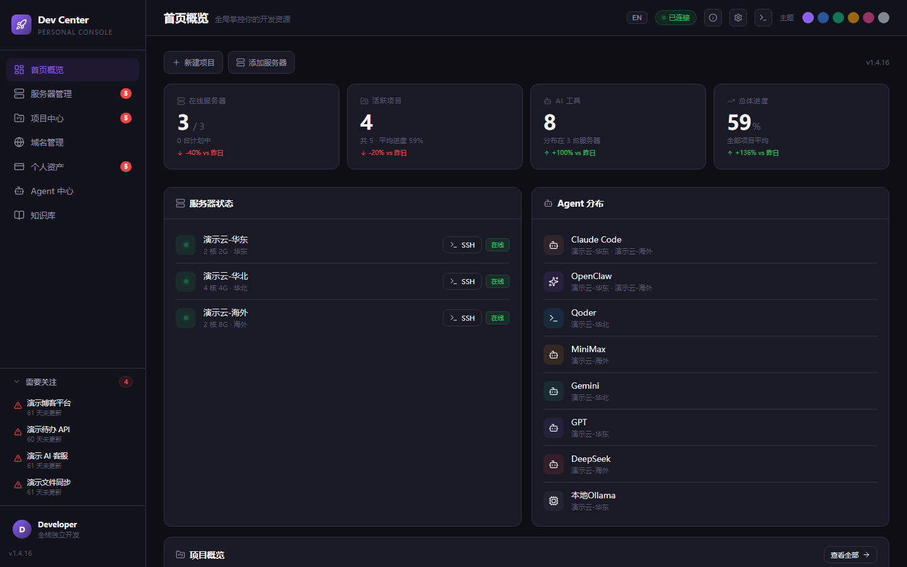
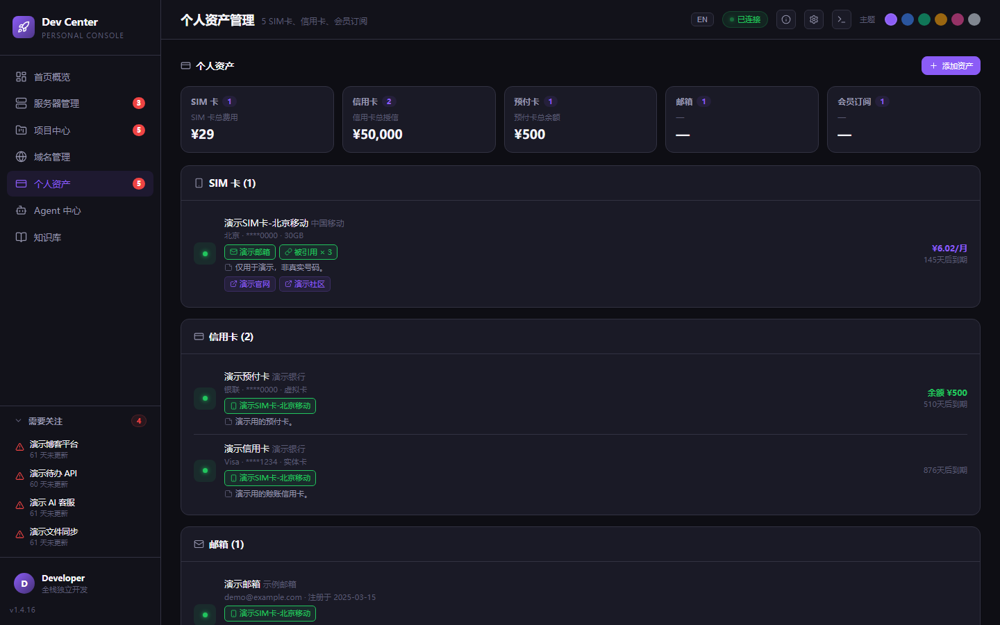
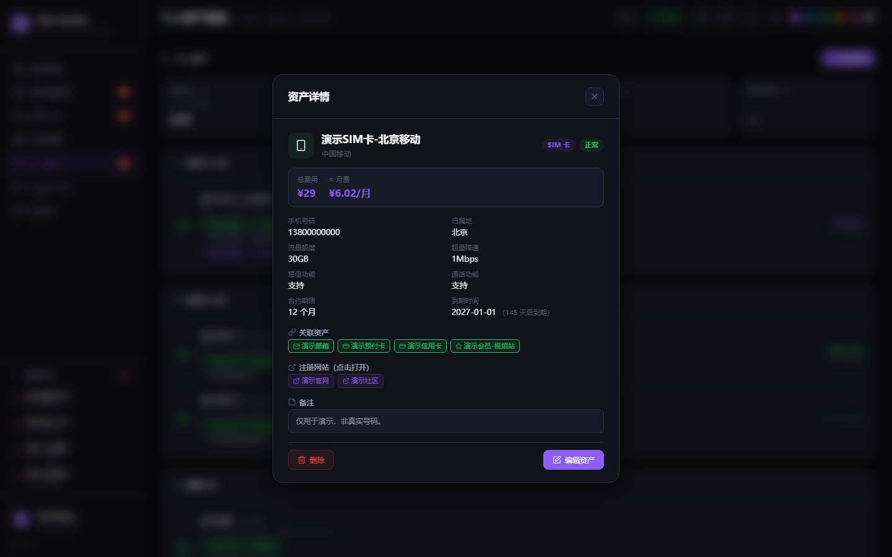
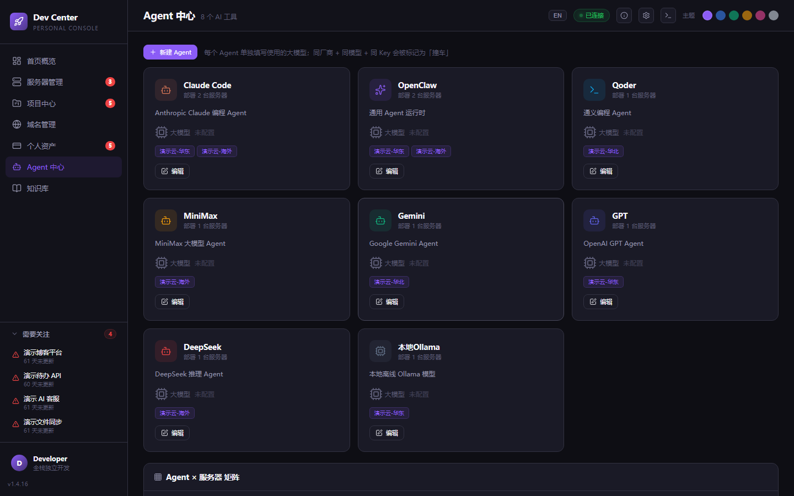
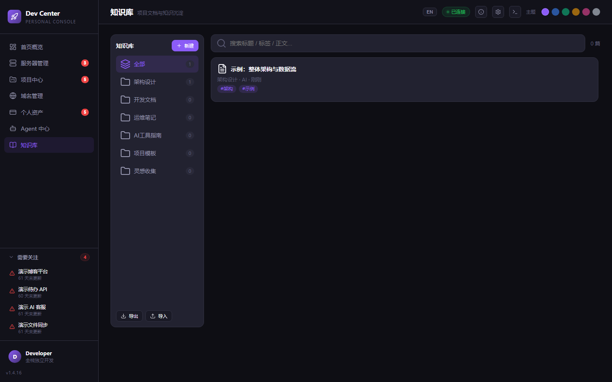

# Personal AI Dev Center

**[English](README_EN.md)** | 中文

> 本地「多服务器 / 多项目管理面板」——一台面板掌控你的全部开发资源：服务器、远程项目、AI Agent、知识库与个人资产。

  

## 简介

Personal AI Dev Center 是一个运行在本地的个人开发控制台。它把散落在多台云服务器上的项目、SSH 同步、AI 编程工具（Agent）、项目文档（Markdown）、知识库和个人资产台账集中到一个桌面应用里管理。

- **Electron 外壳 + FastAPI 后端**（localhost:8765）+ **纯静态 SPA**（无前端构建步骤）
- **SSH/Paramiko 同步引擎**：tar-over-SSH 双向增量同步，文件清单走 stdin，下载对服务器**只读零写入**
- **可选 LLM 分析**：对项目 Markdown 文档做智能分析（OpenAI 兼容接口，可配多套）
- 数据全部存本地（`%APPDATA%/Personal AI Dev Center/`），不上传任何云端

## 截图

| 首页概览 | 个人资产 |
|---|---|
|  |  |

| 资产详情卡片 | Agent 中心 | 知识库 |
|---|---|---|
|  |  |  |

> 截图中均为内置演示数据（`config.example.json`），非真实环境。

## 功能特性

- **首页概览**：在线服务器、活跃项目、AI 工具、总体进度一屏掌控
- **服务器管理**：多台云服务器卡片、TCP 端口实时测速（并行）、一键 SSH 终端
- **项目中心**：项目卡片 + 进度/优先级/技术栈，远程 `TODO.md` / `PROGRESS.md` / `ISSUES.md` 解析同步
- **双向文件同步**：增量下载 / 上传（tar-over-SSH 批量传输，流式解包，逐文件进度，可取消；下载不改动服务器任何文件）
- **Agent 中心**：管理各 AI 编程工具及其使用的大模型（厂商/模型/Key），同厂商+同模型+同 Key 自动标红「撞车」提醒
- **知识库**：分类 Markdown 笔记 + 编辑器（左写右预览）+ 全文搜索 + 导出/导入备份
- **个人资产**：SIM 卡 / 信用卡（含预付卡余额）/ 邮箱 / 会员订阅台账；总额一览统计卡；注册网站可点击打开；**跨资产主键-外键关联**（邮箱/信用卡/会员 ↔ 手机号 ↔ 邮箱，双向同步、增删自动更新选项、删除自动清理引用）；点击先出详情卡片再进编辑
- **域名管理**：域名 / 资产台账
- **LLM 智能分析**：同步时对项目文档做 AI 分析（issues/todos/架构/总结）

## 技术架构

```
┌────────────────────────────────────────────┐
│ Electron 外壳（electron/main.js）           │
│  └─ spawn FastAPI 后端（localhost:8765）    │
├────────────────────────────────────────────┤
│ backend/app.py    FastAPI：REST API + 静态SPA│
│ backend/sync.py   SSH 同步引擎（Paramiko）   │
│ backend/llm_analyzer.py  LLM 分析（raw HTTP）│
│ index.html        单文件 SPA（无构建步骤）   │
├────────────────────────────────────────────┤
│ config.json       唯一事实源（gitignored）   │
│ %APPDATA%/.../    知识库 / 运行时数据        │
└────────────────────────────────────────────┘
```

数据流：SPA 编辑配置 → `config.json` → 手动触发同步 → SSH 读取远程 Markdown → 解析（可选 LLM 增强）→ `backend/data/latest.json` → SPA 渲染仪表盘。

## 快速开始

### 方式一：下载打包好的 exe（Windows）

从 Releases 下载 `Personal-AI-Dev-Center.exe`，双击即用（portable，免安装）。首次运行会自动把演示配置复制到 `%APPDATA%/Personal AI Dev Center/config.json`，之后改成你自己的服务器即可。

### 方式二：源码运行

```bash
pip install -r backend/requirements.txt
python backend/app.py
# 打开 http://localhost:8765
```

开发模式（Electron 热调试）：

```bash
npm install
npm start
```

### 自行打包

```bash
npm run build        # portable exe → dist/
npm run build:setup  # NSIS 安装包
```

## 配置说明

1. 复制 `config.example.json` 为 `config.json`（或直接用界面编辑，会自动生成）
2. 填入你的服务器（host/user/port/SSH key 路径）与项目（remote_path）
3. SSH 免密：用 `deploy_key.ps1` / `deploy_key.sh` 把本机公钥部署到服务器
4. LLM 分析：在「设置」里填 OpenAI 兼容接口（厂商/base_url/api_key/model），支持多套配置切换

**隐私设计**：真实 `config.json`（含 IP / 密钥 / 资产数据）被 `.gitignore` 排除，永远不会入库；仓库内的 `config.example.json` 是一套纯演示模拟数据，截图也全部基于演示数据。

## 目录结构

```
├── electron/          Electron 外壳（main.js / preload.js / 图标）
├── backend/
│   ├── app.py         FastAPI 应用（API + SPA 托管）
│   ├── sync.py        SSH 同步引擎（增量下载/上传、Markdown 解析）
│   ├── llm_analyzer.py LLM 分析
│   └── requirements.txt
├── index.html         单文件 SPA（全部前端，无构建）
├── config.example.json 演示配置（模拟数据，可安全分享）
├── templates/         远程项目 Markdown 约定（TODO/PROGRESS/ISSUES）
├── docs/              文档与截图
└── package.json       electron-builder 配置
```

## 同步机制

- **手动触发**：UI 按钮 / `/api/sync` / `/api/sync/{project_id}`，无自动调度
- **增量**：按 mtime+size 对比，只传变化的文件
- **下载**：远程 `find` 一次性扫描（只读）→ `tar --null -cf - -T -`（清单走 stdin，无命令行长度上限，服务器零写入）→ 本地流式解包，逐文件进度，支持取消
- **上传**：本地打包 tar 流式上传，远程解包（上传前可预览文件清单）
- **忽略规则**：默认智能过滤（跳过 `.git` / `node_modules` / `__pycache__` 等目录与 csv/log/zip/exe 等扩展名）；每次下载/上传可现场选择「智能过滤」或「全部文件」
